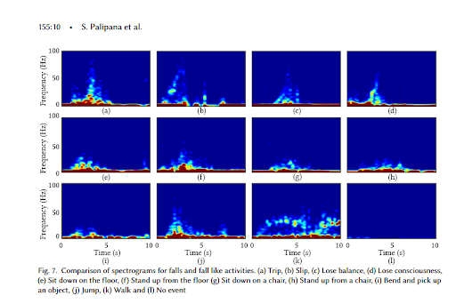
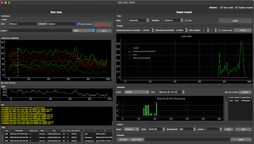
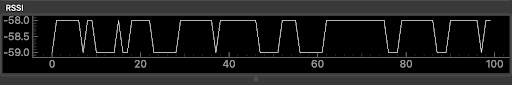
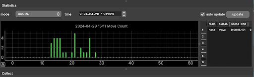
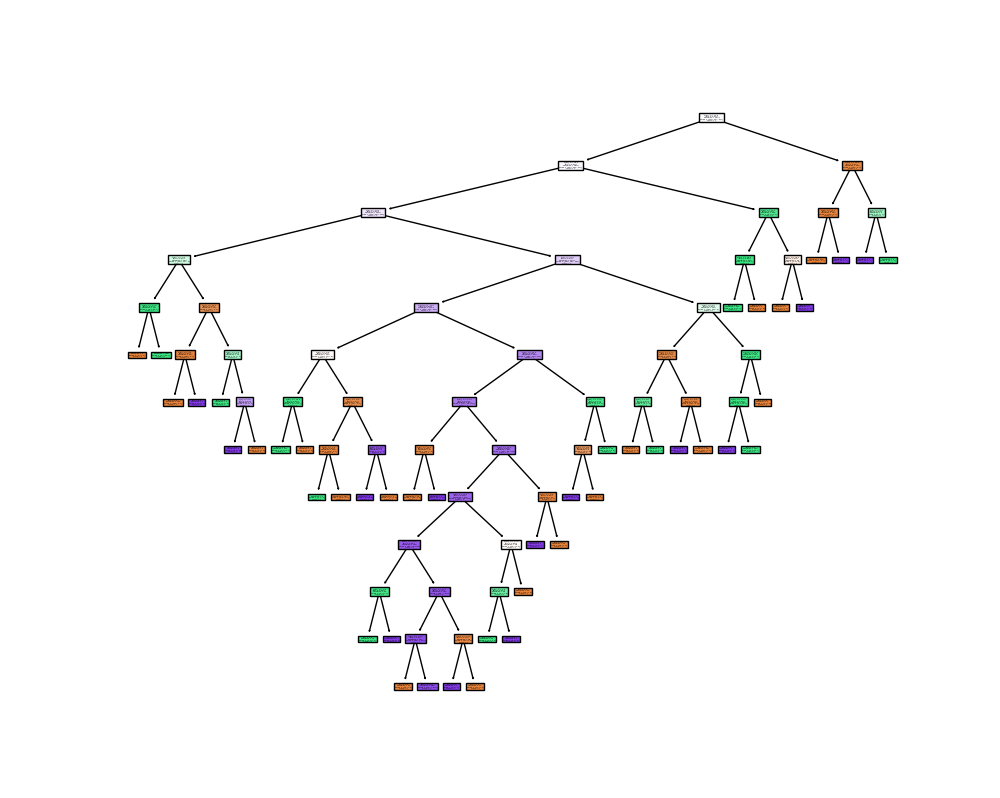
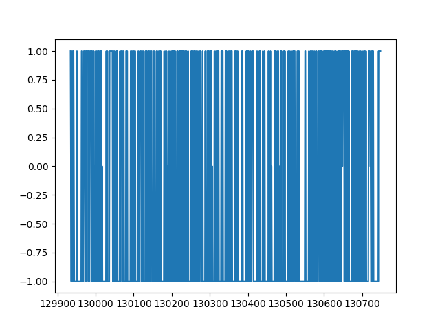
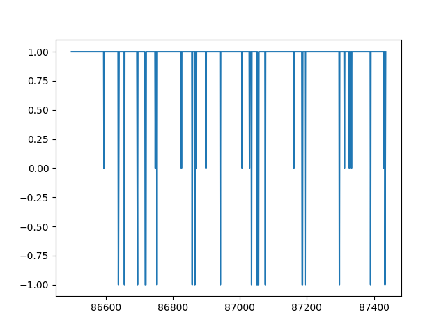
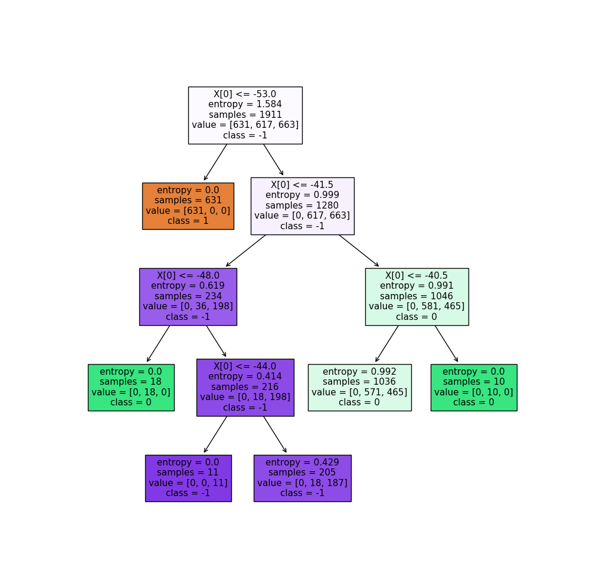
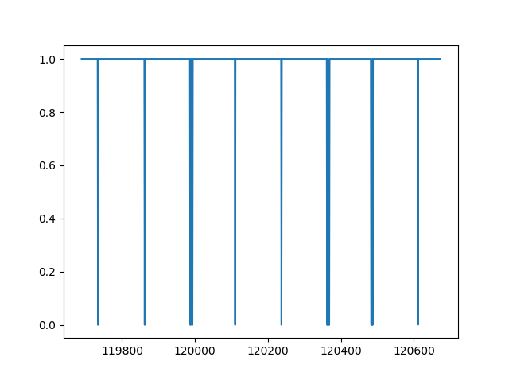
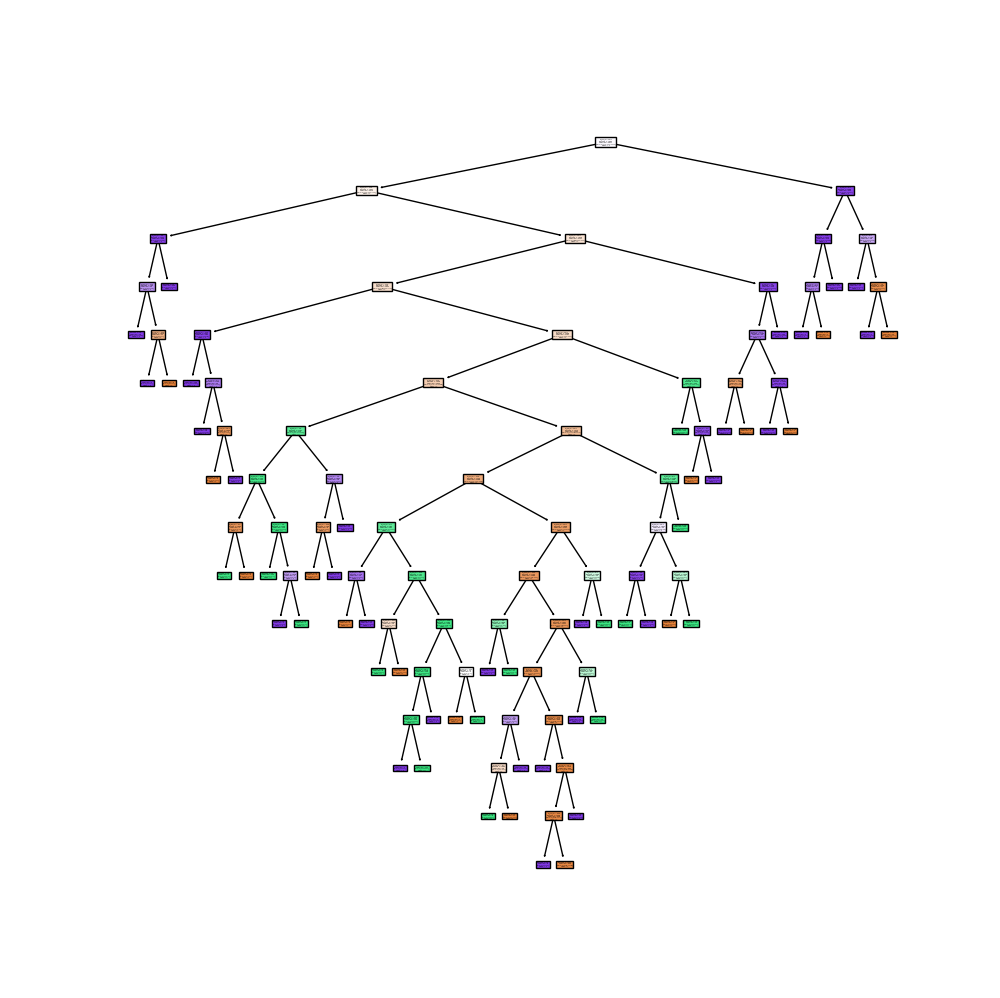

# NET4104-human-detection

Projet du cours NET4104 - Internet sans fil : concepts, technologies et architectures

## Membres

- BONNIVARD Adrien adrien.bonnivard@telecom-sudparis.eu
- DECTOT Esteban edectot--lemo@telecom-sudparis.eu
- VAN VLIERBERGHE Roxane roxane.van_vlierberghe@telecom-sudparis.eu
- LE VALLOIS Armand armand.le_vallois@telecom-sudparis.eu
- MENRATH Louis louis.menrath@telecom-sudparis.eu

# Sommaire

- Objectifs
- Guide de démarrage
- Description théorique

# Objectifs

## Détecter la chute d'une personne à l'aide des canaux CSI avec un ESP-32

Pour ce faire nous découpons la tâche en plusieurs étapes:

* Connecter un esp-32 à un ordinateur via le port UART
* Connecter un esp-32 à un routeur wifi
* Récupérer les CSI à l'aide d'un programme
* Le programme enregistre les données capturés dans des fichier .csv qui sont ensuite analysés en python.
* Entraîner un modèle de machine learning pour détecter la chute d'une personne à partir des fichier .csv enregistrés.
* Écrire un programme python capable de récupérer les données en temps réel et d'en faire une prédiction instantanée.


# Guide de démarrage

```bash
git submodule update --init --recursive
```

* Brancher l'ESP-32 à l'ordinateur via le port UART et non USB
* Ouvrir le terminal et se placer dans le dossier `esp-idf` et exécuter les commandes suivantes:

```bash
cd esp-idf
git checkout v5.0.2
git submodule update --init --recursive
./install.sh
. ./export.sh
```

* Se placer dans le dossier `esp-csi` et exécuter les commandes suivantes:

Attention à bien vérifier que le port UART est le bon

Sur linux le port UART est généralement `/dev/ttyUSB0` ou `/dev/ttyUSB1`
```bash
ls /dev/ttyUSB*
```

Sur MacOS le port UART est généralement `/dev/cu.SLAB_USBtoUART`
```bash
ls /dev/cu.*
```
Une fois le port trouvé, il faut se rendre dans le fichier `csi-recv.sh` et modifier la ligne suivante:

Par exemple si le port UART est `/dev/cu.usbserial-2130` la ligne devrait ressembler à ceci:

```bash
idf.py flash -b 921600 -p /dev/cu.usbserial-2130
```
Ensuite, exécuter les commandes suivantes:

```bash
make install-esp-idf
make csi-recv
```

* Pour accèder à l'interface du projet esp-csi, exécuter la commande suivante:

```bash
cd esp-csi/examples/console_test/tools
# Install python related dependencies
pip install -r requirements.txt
# Graphical display
python esp_csi_tool.py -p /dev/ttyUSB1
```

* Lacement de la transmission des données.

1. Remplacer les valeurs de `SSID` et `PASSWORD` dans le fichier `live-transmission.py` par les valeurs de votre réseau wifi

2. Exécuter les commandes suivantes:

```bash
cd live-transmission/
make setup
make install
make start-transmission
```

## Comment régler certains problèmes courants ?

### Core dump

    Warning: Ignoring XDG_SESSION_TYPE=wayland on Gnome. Use QT_QPA_PLATFORM=wayland to run on Wayland anyway.
    qt.qpa.plugin: Could not load the Qt platform plugin "xcb" in "" even though it was found.
    This application failed to start because no Qt platform plugin could be initialized. Reinstalling the application may fix this problem.

    Available platform plugins are: eglfs, linuxfb, minimal, minimalegl, offscreen, vnc, wayland-egl, wayland, wayland-xcomposite-egl, wayland-xcomposite-glx, webgl, xcb.

    open serial port:  /dev/ttyUSB0
    Abandon (core dumped)

Cela peut arriver lorsqu'il y a une incompatibilité entre 2 applications, pour y remédier on repète la commande précédée de:

    QT_QPA_PLATFORM=wayland !!


## DESCRIPTION THEORIQUE DU PROJET

### Introduction 

La norme Wi-Fi ne cesse d’évoluer sous l’impulsion du groupe de travail de l’IEEE 802.11. Son utilisation déjà très étendue au sein des foyers ne cesse de s’étendre et ses spécificités de s’améliorer avec une augmentation du débit ou de la couverture. Un élément crucial pour assurer la fiabilité de la communication Wi-fi repose sur les informations d’état du canal ou Channel State Information (CSI) en anglais. A l’aide de ses informations récapitulant la diffusion, l’affaiblissement et la diminution de la puissance du signal entre l’émetteur et le récepteur en temps réel, il est alors possible d'adapter les caractéristiques du signal comme sa puissance d’émission et ainsi maintenir une qualité de transmission des données.

Au-delà, de sa fonction primaire de maintien de la qualité de la communication entre les deux terminaux, une idée est de récupérer ses variations sur un ensemble émetteur/capteur fixe pour détecter des changements dans l'environnement de diffusion des ondes. On peut alors imaginer de nombreuses applications comme la détection de mouvement pour la sécurité ou même dans notre cas la détection de chute. L’objectif est alors fondamentalement de pouvoir détecter si une personne est debout ou allongée dans une pièce.

### Découverte du matériel et solutions existantes

Pour réaliser notre projet, nous avons d’abord essayé de faire quelques manipulations avec l’ESP32. 

Grâce à des  essais avec MicroPython, nous nous sommes plongés dans la découverte de notre esp32s3. Notre démarche initiale a consisté à flasher le microcontrôleur et à intégrer des programmes exécutables. Toutefois, nous avons rapidement constaté que Python, en tant que langage de haut niveau, ne permettait pas une communication exhaustive et précise avec notre microcontrôleur et risquait de compliquer notre tâche tout en étant moins efficace. C'est pourquoi nous avons opté pour une transition vers le langage C. Naturellement, nous nous sommes dirigés vers le projet d’Espressif : ESP-IDF, pour flasher notre esp32s3. Cette transition nous a offert une plus grande flexibilité et un contrôle plus fin sur les interactions avec notre microcontrôleur. De plus, le projet propose de nombreux exemples ainsi que certaines lignes de commandes adaptable à notre projet (on peut citer les “Console Examples” [5]).

Concernant les solutions existantes, nous avons commencé par réunir différents articles scientifiques qui pouvaient nous permettre de détecter des personnes à l’aide du CSI (Channel State Information). Nous nous sommes appuyés sur les sources [1] [2] et [3] afin de comprendre le fonctionnement d’une telle solution.
Les différents évènements qui se produisent dans un environnement dans lequel nous aurions mis en place un système de récepteur / émetteur sont détectés grâce à des seuils sur le RSSI [1]. En effet, le but est d’abord de déterminer la fréquence du bruit constant pour une pièce donnée, puis d’analyser le spectre obtenu grâce au CSI (par une transformation dans le domaine des fréquences, la méthode n’est cependant pas plus détaillée dans notre source). Nous voyons ici sur ces spectres une très nette différence entre les diverses chutes. 




Ensuite, nous avons trouvé une solution fournie sur un dépôt git qui est la suivante [4] https://github.com/espressif/esp-csi (plus précisément dans examples/esp-radar). 
Cette solution présente une interface graphique qui contient différentes courbes. Celles-ci permettent de visualiser les évènements qui se produisent dans un environnement donné. Pour utiliser le projet, il faut d’abord installer les bibliothèques et divers requirements sur l’esp32 (se référer aux indication précédant le début du rapport), puis de lancer l’interface sur son ordinateur afin de visualiser les courbes en temps réel. Il nous a fallu un peu de temps pour comprendre qu’il nous fallait ajouter esp-idf en submodule pour que l’environnement fonctionne. 

Le projet ESP-CSI se base sur deux langages de programmation. Une première partie en C pour communiquer directement avec l’ESP-IDF lui-même. Cette communication ne permet pas seulement de récupérer le vecteurs représentant CSI mais aussi de pouvoir se connecter à un point d’accès Wi-Fi faisant office d’émetteur. Ce point d’accès Wi-Fi peut aussi bien être une box internet qu’un point d’accès CISCO ou même un smartphone en point d’accès mobile (option choisie dans notre cas pour des raisons de simplicité et de volatilité)

### Premiers tests avec la solution existante




La prise en main de la solution git sur nos machines n’a pas été évidente. Nous avons tout d’abord eu du mal à comprendre le projet en lui-même car nous avons découvert plus tard que beaucoup de morceaux avaient été générés automatiquement à l’aide d’un autre outil que nous ne connaissions pas. La documentation de ce projet se concentre également uniquement sur l’installation et l’explication pratique de l’interface graphique, sans mention autre de la structure du code. Il a donc été difficile pour nous de réellement savoir ce que nous pouvions modifier ou non dans le projet afin de nous l’approprier et d’en faire quelque chose d’un peu différent. 


Après avoir croisé avec différentes sources ([1] et [2]) particulièrement, nous avons donc compris que l’auteur s’appuyait sur des variation du RSSI à partir d’un certain seuil et que c’était comme cela qu’il était capable fournir a priori des informations précises sur ce qu’il se passait dans la pièce. En effet, l’interface nous permet de recueillir des données liées uniquement à des évènements comme la présence d’une personne, la chute d’une personne, les mouvements d’une personne, le fait qu’elle est statique ou non. Malheureusement, nous avons eu l’impression que l’application n’était pas très efficace pour discerner exactement de quel type de mouvement il s’agissait. Toutefois, elle était particulièrement réactive pour détecter si oui ou non il y avait une personne présente dans la pièce, nous nous sommes donc quand même appuyé sur ces travaux.




Techniquement, nous avons dans un premier temps, configuré deux microcontrôleurs, l'un en tant que récepteur (receiver) et l'autre en tant qu'émetteur (sender), pour évaluer la communication entre les deux. Par la suite, nous avons effectué des tests plus avancés en utilisant un seul microcontrôleur connecté à notre point d'accès mobile via l'un de nos smartphones. Ces étapes nous ont permis de mieux comprendre les capacités et les performances de notre système dans différents scénarios d'utilisation. L’interface graphique que donne le projet git permet de voir en direct la détection potentielle d’humains, mais également d’enregistrer ces données dans des csv.




### Récolte de données

#### a) Méthode de récolte

La récolte des données s’est faite à l’aide du projet git [insérer source]. Cela nous a permis de bénéficier d’une interface graphique qui nous a permis de récolter sous la forme de csv, différents échantillons de données. 
Nous avons capturés en tout 33 enregistrements, tous enregistrés dans le Tijet, qui est une pièce quasi sans meubles.

Les enregistrements ont tous une durée de 10 secondes. Il y a en tout 14 enregistrements d’une personne debout et 11 d’une personne allongée. Nous avons également quelques enregistrements de la pièce vide, afin de pouvoir aussi détecter si il y a quelqu’un ou non dans la pièce, et d’adapter le comportement en fonction. Malheureusement, nous verrons que ces enregistrements n’étaient pas propres, d’où l’intérêt de faire très attention à la manière de récupérer les données.

#### b) Défauts 

Il aurait fallu récolter des données dans beaucoup plus de pièces afin d'entraîner notre IA sur quelque chose de plus neutre. Le tijet présente l’avantage et le défaut de n’avoir quasi aucun obstacle, ce qui nous permet certes d’avoir des données propres et nettes à fournir à notre IA, mais ces données sont assez éloignées de la réalité. Nous nous sommes également contentés d’enregistrer une seule personne, notre modèle ne fonctionnera sans doute pas si il y a beaucoup de personnes présentes dans la pièce.

Un autre défaut de notre système de récolte est que nous nous sommes appuyés sur l’interface et le code de notre source, qui sont donc pré-existants et qui peuvent également contenir certaines erreurs de contenu.

De plus, il fallait énormément de rigueur pour les enregistrements et il se peut qu’ils soient en fait soumis à beaucoup de bruit par rapport à ce dont nous aurions eu besoin pour entraîner notre IA. Cela conduira à de nombreuses difficultés sur l’analyse de données, que ce soit par voie IA ou manuellement en refaisant des seuil de détection sur le RSSI.

### Adaptation à notre cas d'utilisation

#### a) But de l'utilisation

Comme expliqué en introduction, notre but était de réfléchir à comment détecter des chutes à l’aide de signaux CSI (Channel State Information) afin de détecter des chutes pour les personnes âgées par exemple. Pour ce faire, notre but était d’abord de comprendre à quoi correspondaient les données RSSI et Data que nous pouvions récolter à l’aide du programme préexistant pour l’ESP32-s3. Nous souhaitions ensuite voir s'il était possible d'appliquer une couche de machine learning afin d'analyser les données CSI avec précision pour pouvoir déterminer si une personne était debout ou couchée.

On pourrait donc étendre ces travaux en mettant en place une méthode de signalement lorsque nous détectons qu'une personne est couchée trop longtemps à des heures "anormales" et ainsi réellement détecter la chute. Comme vu dans la première partie, il est aussi possible de caractériser différents types de chute, mais nous ne nous y attarderons pas ici.


#### b) Analyse par IA

Afin d’analyser nos données et déduire de la présence ou non d’une personne et de son statut (debout ou couché), nous avons fait le choix d'entraîner un réseau de neurones de type arbre de décision. Pour ce faire, nous avons joué avec plusieurs jeu de données enregistrés par nos soins et nous avons donc obtenu plusieurs IA "différentes". Afin de faicliter l'affichage sur nos graphe, nous avons décidé de symboliser la position "debout" par l'entier 1, la position "coucher" par l'entier 0 et "rien" par -1. Voici le graphe de décision du premier réseau de neurones :



Cette IA 98.208% de réussite sur les données de tests, mais on peut aussi forcer le réseau de neurones à avoir moins de profondeur, ce qui réduit sa précision à 95%, ce que nous avons fait ici.
Sur les nœuds, nous pouvons globalement voir que l’IA s’appuie sur différentes valeurs dans le vecteur data pour ensuite aller effectuer différents choix. Ce graphe est typiquement tronqué car nous avons limité la profondeur maximale de l’IA. l’information principale à retenir de cette figure est qu’il lui faut un grand nombre de choix avant de réussir à déterminer précisément parmi seulement 3 états. Nous pouvons questionner la pertinence d’utiliser de l’IA pour déterminer ce genre d’états, étant donné que la méthode par détermination de seuil sur le RSSI permet une détection moyenne plus précise que l’IA, même si elle paraît moins adaptable aux premiers abords.

Nous avons décidé d’utiliser un arbre de décision car c’est typiquement ce que ferait un humain dans ce genre de cas. En effet, l’arbre de décision consiste à regarder les données en entrée une à une, pour déterminer celles qui sont pertinentes et faire une suite de choix correspondant à chacune d'elles. 

Les données fournies au modèle sont la catégorie “data” du csv fourni par l’application git. Ces données contiennent les informations des 104 sous-canaux du canal 11 qui a été jugée par les créateurs des outils “esp-idf” comme un canal assez propre pour pouvoir analyser ses données et en tirer des informations intéressantes. 
Ici, cette IA permet de déterminer si une trame écrite sur le fichier csv correspond à un humain debout (état : 1), couché (état 0) ou pas d’humain (état -1).

Malheureusement, notre IA présente de nombreux défauts que nous allons détailler. 
Lorsqu’on lui donne certains enregistrements, elle se trompe totalement de catégorisation. Mais d’autres fois, ce n’est pas le cas comme nous le voyons sur ces deux figures : 




Ici, nous aurions dû avoir d'une façon quasi constante la valeur 1, hors nous voyons qu'il y a un changement de valleur extrêmement fréquent qui parasite la lecture du graphique et donc ne permet pas du tout de savoir si il y a une personne et dans quel état elle est. Le taux de réussite de la prédiction par rapport à ce qu'on attendait (une valeur constante à 1) est de 30% environ




Ici, contrairement au premier cas, nous voyons de manière assez nette qu'il y avait une personne et qu'elle était debout sur l'enregistrement. Le taux de réussite de détection ici est d'environ 90%

Ce problème vient sûrement d’un défaut de pureté de nos enregistrements. Lorsque l’on regarde les enregistrements de plus près, sur le rssi par exemple, on se rend en effet compte que deux enregistrements (debout_2 et allonge_5) ont les mêmes valeurs de rssi, donc surement aussi le même vecteur “data”. 

En nettoyant alors notre set de données pour ne prendre que les enregistrements réussis, le taux de réussite pour déterminer si un humain est debout ou couché passe à environ 70% sur des nouvelles données. Toutefois, il n’arrive quand même pas à différencier “couché” de “rien”.

Nous avons également testé de simplement donner le ‘rssi’ comme donne à l’IA au lieu de lui donner le vecteur data, pour voir si cela ne l'aidait pas à mieux détecter ce qu'il se passait. Nous obtenons, après nettoyage des données, un graphe de décision beaucoup plus simple.

{ width=50% }


Nous observons ici que l’IA cherche différents seuils de RSSI, d’une manière un peu plus précise que ce que ferait un humain, pour ensuite pouvoir déterminer l’issue. Nous pouvons quand même remarquer que sur la décision la plus profonde, elle semble ne pas faire de choix puisqu’elle attribue quoi qu’il arrive la valeur -1 à la classe. De même pour le côté à droite, en vert. Cela est sûrement justifiée avec l’entropie, puisqu’elle va chercher à avoir une entropie optimale (paramètre donné explicitement lors de la création de l’IA). Cet entraînement nous donne des résultats bien plus satisfaisants comme nous le voyons ici sur la classification de l’enregistrement “debout_5”, avec un taux de réussite de 98,2%.

{ width=50% }


Malheureusement, même avec la méthode sur le RSSI, l'IA continuait de présenter certains défauts de détection, nous avons donc décidé de refaire nos enregistrements.

Afin de sélectionner les enregistrement qui parraissaient le plus propres, nous avons appliqué un simple algorithme de détection par seuil sur le RSSI, avec une méthode similaire à celle décrite dans les papiers scientifiques que nous avons lu. 

Voici le nouveau graphe de décision que nous avons obtenu suite à cela :

{ width=50% }

On peut observer que la profondeur de cet arbre semble beaucoup plus pertinente que précédemment. Nous remarquons que l’IA fait réellement des choix sans aller chercher à apprendre par cœur ses données d’entraînement. Grâce à ce nouvel entraînement, les résultats sont beaucoup plus convaincants. Ici, la prédiction sur un enregistrement de personne allongée.

")


On remarque cette fois que l’IA classe bien les données de l’enregistrement et on obtient une nette tendance à montrer qu’elles montrent une personne couchée (valeur 0), avec un taux de réussite de 90%. 

Pour conclure sur cette partie, nous avons donc testé deux manières de donner la data à notre IA, en lui fournissant le vecteur “Data” simplement, ou juste le RSSI. Nous avons rencontré différents problèmes sur le fait de simplement coder l’IA (nous ne connaissions pas cette manière de faire auparavant), puis sur la pureté de nos échantillons qu’il a fallu revoir. 

#### c) Récupération et analyse des données

Notre but est de pouvoir analyser des données CSI en flux continu, fournies par l’esp32. Le programme de récupération de données en continu est constitué d’une fonction t serial_handle, qui gère la communication avec l'ESP32 via le port série. Cette fonction opère en boucle infinie, recevant continuellement les données transmises par l'ESP32. Elle applique des règles de traitement spécifiques pour différentes catégories de données, notamment les données CSI. Une fois les données CSI reçues, elles sont décodées et stockées dans des fichiers CSV pour une analyse ultérieure mais aussi affichées en direct pour répondre à cette problématique d’analyse en temps réel. Ce qu’on garde correspond à la liste de 104 valeurs du vecteur de data relatif aux données CSI.

Cette fonction provient du projet ESP-CSI disponible sur Github. Au sein de ce projet, le fichier esp_tool.py dans lequel elle se trouve a pour but de fournir toutes les fonctions nécessaires à la récupération de données ainsi qu’à la communication avec l’interface visuelle. Un peu de rétro-ingénierie nous a permis d'extraire la fonction serial_handle et d’en modifier les lignes pour ne garder que ce dont nous avons besoin.
En plus de cette fonction, il nous faut la fonction base64_decode_bin pour pouvoir décoder les données. 

La fonction main agit comme point d'entrée principal du script. Elle analyse les arguments de ligne de commande, configure une file d'attente pour la communication avec le processus de gestion du port série, puis lance ce processus. Cette structure modulaire permet une gestion efficace de la communication avec l'ESP32 tout en facilitant l'extension et la maintenance du script.

Une fois cela réalisé, il nous a fallu y ajouter la partie analyse de données. Pour cela, nous avons importé le code existant dans le fichier live-transmission.py.
Le modèle s'entraîne avant même que la communication commence. Ensuite, chaque vecteur est évalué avec l’IA générée ce qui nous permet de savoir en tant réelle le comportement d’un humain en déplacement.

### Conclusion

Nous avons rencontré beaucoup de difficulté à entraîner un réseau de neurones pour détecter les chutes à cause de la dificulté à obtenir des données propres. Nous aurions aimé pouvoir mieux les traiter et obtenir une IA qui avait un taux de réussite bien plus proche des 90% que des 80%. En effet, lors de l'analyse en flux continu, il est parfois difficile d'interprêter ce qu'il se passe, c'est pourquoi nous avons fait le choix d'observer les trames par paquet au lieu de une à une. 

De plus, la détection par CSI est assez difficile à mettre en place puisque nous avons remarqué qu'il fallait être dans des endroits très précis pour être bien détectés.

Toutefois, nous avons désormais de nombreuses pistes d'amélioration possible : \
    - refaire des enregistrements aussi propres que possibles dans plus de pièce différentes pour donner un jeu de données plus neutre au réseau de neurones, \
    - ajouter la détection de différents types de chute au lieu de simplement debout/coucher \
    - ajouter une interprétation directe des résultats pour prévenir lorsque l'on suppose que la personne a chuté.


# Références


[1] [FallDeFi: Ubiquitous Fall Detection using Commodity Wi-Fi Device](https://dl.acm.org/doi/10.1145/3161183) \
[2] [WiFi Sensing with Channel State Information: A Survey](https://gzhou.pages.wm.edu/wp-content/blogs.dir/5736/files/sites/13/2017/12/WiFiSenseSurvey_CSUR19.pdf) \
[3] [Seeing through walls with WIFI… How to extract Wifi CSI data with a RPI Compute Module 4 | by Nezare Chafni](https://blog.chafni.com/seeing-through-walls-with-wifi-how-to-extract-wifi-csi-data-with-a-rpi-compute-module-4-ec36c7d0c1da#9741)   \
[4] https://github.com/espressif/esp-csi \
[5] https://github.com/espressif/esp-idf/tree/master/examples/system/console


